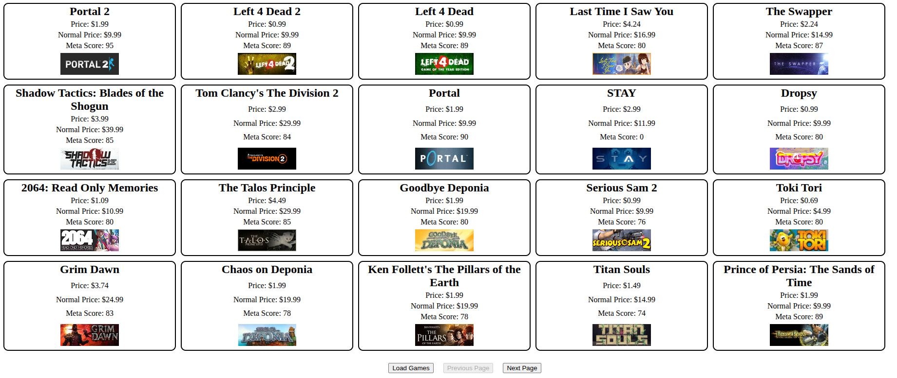

# Communication avec un service web externe

Cet exercice couvre les notions de communication HTTP à l'aide de l'API `Fetch` avec un service web externe.

Le site web de l'exercice permet d'afficher les informations des jeux vidéo en promotion sur la plateforme [Steam](https://store.steampowered.com/). Il utilise l'API de [CheapShark](https://www.cheapshark.com/) pour récupérer les données à afficher.

Voici l'affichage après avoir récupéré les jeux vidéo en promotion :

*Note : l'affichage peut différer en fonction des jeux vidéo en promotion au moment de l'exécution.*

## API de CheapShark

Afin de compléter l'exercice, vous aurez à utiliser l'[API de CheapShark](https://apidocs.cheapshark.com/), spécifiquement la route `/deals` pour récupérer les jeux vidéo en promotion.

Consultez la documentation pour comprendre les paramètres à envoyer dans la requête et le format de la réponse. Prêtez attention aux paramètres de l'URI de la requête pour obtenir les bonnes informations. Notamment, l'identifiant du magasin (`1` pour Steam), le nombre de jeux à récupérer (`20`) par requête ainsi que la page en cours.

## Fonctionnalités à implémenter

### Récupération des jeux vidéo en promotion

La première partie de l'exercice consiste à communiquer avec l'API de CheapShark afin de récupérer les **20** jeux vidéo en promotion et les afficher dans la page web sous la forme de vignettes. La récupération des jeux se fait à travers le bouton `Load Games`. 

Une structure de base de la vignette d'un jeu vous est fournie dans le fichier [index.html](./index.html). L'image de chaque jeu est également un lien vers la page jeu à travers le lien de redirection de CheapShark. Vous devez construire autant de vignettes que de jeux récupérés par la requête. La documentation de l'API contient

Vous devez compléter la fonction `loadGames()` dans le fichier [index.js](./index.js) pour envoyer la requête à l'API de CheapShark et l'ajouter au bon bouton de la page. Consultez la document de l'API pour savoir comment cibler le bon magasin et le nombre de jeux à récupérer.

### Gestion de la pagination

La pagination est un concept qui permet de récupérer les données en plusieurs requêtes, plutôt que de tout récupérer en une seule fois. Cela est utile pour éviter de surcharger le serveur et pour améliorer les performances de l'application. Ex : 1000 données sont séparées en 20 "pages" de 50 données chacune. Chaque page est récupérée par une requête distincte.

La deuxième partie de l'exercice consiste à gérer la notion de pagination de l'API utilisée. Par défaut, c'est les X premiers jeux vidéo en promotion qui sont récupérés. Vous devez permettre à l'utilisateur de naviguer entre les pages de jeux vidéo en promotion à travers les boutons `Previous Page` et `Next Page`. Si vous êtes à la première page, le bouton `Previous Page` doit être désactivé et le bouton doit s'activer si vous êtes sur toute autre page. 

Vous devez modifier la fonction `loadGames()` pour prendre en compte la page courante et ajouter le bon comportement aux boutons de navigation. Vous devez également mettre à jour l'affichage des jeux vidéo en promotion pour afficher la page courante.

### Exercice bonus : changement de magasin

L'exercice bonus consiste à permettre à l'utilisateur de changer le magasin pour lequel il veut récupérer les jeux vidéo en promotion. Par défaut, le magasin Steam est utilisé, mais vous pouvez ajouter un sélecteur de magasin dans la page web pour permettre à l'utilisateur de choisir un autre magasin. Consultez la documentation de l'API de CheapShark pour trouver la liste des magasins disponibles et leurs identifiants.
Vous devez modifier la fonction `loadGames()` pour prendre en compte le magasin sélectionné par l'utilisateur. Le sélecteur de magasin doit être ajouté dans le fichier [index.html](./index.html) et vous devez mettre à jour la requête pour utiliser l'identifiant du magasin sélectionné.

## Solution

Une solution possible est disponible dans le fichier [solution.js](./solution.js). Vous êtes fortement encouragés de compléter l'exercice par vous-mêmes avant de regarder la solution, mais vous pouvez à tout temps consulter la solution finale pour mieux comprendre le fonctionnement des différentes notions.